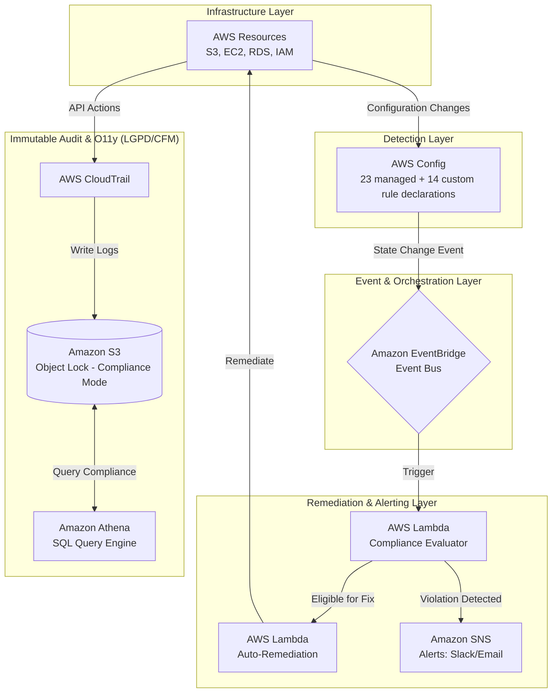

# Wayfinder Cloud

A portfolio project modeling AWS cloud governance for a healthcare case study.

> **Project status:** This repository contains Terraform configurations, four Python
> 3.12 Lambda handlers, and 115 unit tests that use AWS mocks. It is not evidence of
> an AWS deployment, production use, legal compliance, or measured detection/remediation
> times. The VitaCore story is a fictional scenario; its incident and impact figures
> are assumptions for the exercise, not a report of a real breach.

---

## Why I built this

I was finishing the AWS Solutions Architect training and had completed 23 hands-on labs.
Each lab taught one piece: KMS encryption, VPC security groups, event-driven pipelines,
CloudTrail logging. But none of them asked me to combine everything with a reason behind it.

So I built something that forced me to make real decisions.

The fictional scenario I used: a digital health company called VitaCore Health.
In the scenario, a developer runs one wrong AWS CLI command.
An S3 bucket with 2,340 patient imaging reports went public.
Nobody caught it for 18 days. A patient found their own CT scan via Google.
The ANPD fine was R$ 420,000. Lost contracts added another R$ 1.6M.

Those figures describe the case study only. WAYFINDER-002 is intended to represent
that misconfiguration; this repository does not demonstrate that it detects or fixes
it in a deployed AWS account.

That is the project.

---

## What it does

The target design is to monitor AWS security and compliance, map violations to LGPD
articles, remediate selected findings, and retain audit data. The diagram below is an
architecture proposal, not a verified live system.



---

## WAYFINDER custom-rule catalog: declared, not operational

The Terraform module declares all 14 names, but declarations and descriptions are
not the same as implemented compliance checks.

| Rule | Intended check | LGPD article | Current code status |
|---|---|---|---|
| WAYFINDER-001 | S3 bucket with health data and no KMS CMK | Art. 46 | Terraform declaration and action metadata only |
| WAYFINDER-002 | S3 bucket with health data and public access on | Art. 46 | Terraform declaration and action metadata only |
| WAYFINDER-003 | CloudTrail disabled | Art. 37, 48 | Terraform declaration and action metadata only |
| WAYFINDER-004 | RDS instance without encryption at rest | Art. 46 | Terraform declaration and severity metadata only |
| WAYFINDER-005 | IAM policy with Action:* and Resource:* | Art. 6, 47 | Terraform declaration and severity metadata only |
| WAYFINDER-006 | EC2 with health data tag in a public subnet | Art. 46, 49 | Terraform declaration and log-only action |
| WAYFINDER-007 | Lambda environment variable that looks like a hardcoded password | Art. 46 | Terraform declaration only |
| WAYFINDER-008 | CloudWatch log group without KMS encryption | Art. 46 | Terraform declaration only |
| WAYFINDER-009 | Security Group with SSH or RDP open to 0.0.0.0/0 | Art. 46 | Terraform declaration only |
| WAYFINDER-010 | DynamoDB table without encryption | Art. 46 | Terraform declaration only |
| WAYFINDER-011 | ECS task definition with privileged=true | Art. 49 | Terraform declaration only |
| WAYFINDER-012 | IAM access key older than 90 days | Art. 47 | Terraform declaration only |
| WAYFINDER-013 | S3 without Object Lock when retention tag is set | CFM + Art. 37 | Terraform declaration only |
| WAYFINDER-014 | Resource with health data tag but no Secrets Manager reference | Art. 46 | Terraform declaration only |

All 14 names are declared as `CUSTOM_LAMBDA` rules in Terraform, but the Lambda
does not implement AWS Config's custom-rule invocation contract (`PutEvaluations`).
It currently parses EventBridge compliance-change events instead. The Python rule
metadata covers only 001–006, and Terraform prefixes rule names with the environment
while the metadata map uses unprefixed names. Consequently, none of these 14 checks
is implemented end to end; this table is a design catalog, not control coverage.

The remediation dispatcher contains actions for 001–003 and a log-only placeholder
for 006. The exemption check, attempt-limit check, and attempt recording are no-op
stubs. Do not treat automatic remediation or its guardrails as operational; the
remaining controls are roadmap items. See ADR-004 for the intended safety rationale.

---

## Architecture decisions I had to make

Every major decision is in a separate file under docs/adr/.
Short version of the nine decisions:

**Why Terraform and not CDK:** CDK generates CloudFormation under the hood.
I wanted to understand what is actually deployed, not what an abstraction generates.
Also shows up in more PJ job listings in Brazil.

**Why event-driven and not scheduled polling:** A scheduled Lambda running every
5 minutes would cost more and detect violations up to 5 minutes late.
EventBridge reacts to the actual change within seconds.

**Object Lock design:** Terraform configures COMPLIANCE mode in prod and GOVERNANCE
mode in dev. The current prod example defaults to 365 days, not 20 years. This
configuration does not establish compliance with CFM 1821/2007; retention needs
legal review and a separately verified value before making a compliance claim.

**Why VPC Endpoints instead of just NAT Gateway:** The Terraform design includes
VPC endpoints for selected AWS services. Connectivity and routing have not been
verified in a deployed account.

**Why selective auto-remediation:** I almost built full auto-remediation for everything.
Then I thought through: what if the Lambda removes an IAM permission that a medical
record system depends on? A doctor cannot log in. That is a different kind of incident.
The decision matrix is the intended policy. The current remediation guardrails are
stubs, so the policy is not enforced end to end yet.

Full ADRs: docs/adr/

---

## How to run this

The following bootstrap and `terraform apply` steps create or modify real AWS
resources and require AWS credentials. They are not needed for the local CI checks
described in CONTRIBUTING.md, and no deployment is evidenced by this repository.

```bash
git clone https://github.com/guinatural/wayfinder-cloud.git
cd wayfinder-cloud

# First time only: create the S3 bucket and DynamoDB table for Terraform state
# Configure an AWS CLI profile named wayfinder-dev and install boto3 first
python -m pip install boto3
python scripts/bootstrap_state.py --env dev --region us-east-1

# Copy the example and fill in your email
cp infra/environments/dev/terraform.tfvars.example \
   infra/environments/dev/terraform.tfvars

cd infra/environments/dev
terraform init -lockfile=readonly
terraform plan
terraform apply
```

Detailed walkthrough: docs/runbooks/RB-002-terraform-operations.md

---

## Project structure

```
infra/modules/     8 Terraform modules
infra/environments/dev + prod
src/lambdas/       4 Python 3.12 functions
src/tests/         unit tests with moto
docs/adr/          9 architecture decision records
docs/runbooks/     5 operational runbooks
docs/compliance/   LGPD article to AWS control mapping
docs/business/     VitaCore scenario and incident post-mortem
.github/workflows/ 4 GitHub Actions workflows (CI checks, Terraform, Lambda deploy)
scripts/           bootstrap script for Terraform state
```

---

## Cost model

The rough design estimates are about $38/month for the dev governance layer and
$870/month for a full modeled VitaCore stack. They are not quotes, measured AWS
bills, or evidence that either environment was deployed. Incident costs are
fictional scenario inputs.

---

## Author

Guilherme Barreto Gomes

[GitHub](https://github.com/guinatural)

---

MIT License
