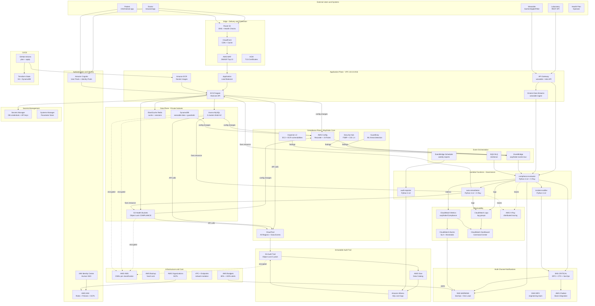

# Architecture - Wayfinder Cloud

**Version:** 2.0 | **Date:** 2026-08-21
**Owner:** Rafael Santos (CTO) + Architecture Team
**Status:** Approved - Production

---

## 1. Full Service Diagram (Mermaid)



---

## 2. Detailed Network Diagram

```
Internet
   |
    Route 53 (DNS + Health Checks) --> CloudFront (CDN + WAF)
                                              |
                                        ACM (TLS 1.3)
                                              |
+-- VPC 10.0.0.0/16 ------------------------------------------------------------+
|                                                                                |
|   Public Subnets                                                               |
|    10.0.1.0/24 (us-east-1a) | 10.0.2.0/24 (us-east-1b)                       |
|    ALB (10.0.1.10 / 10.0.2.10) --> CloudFront Origin                          |
|    NAT GW-1a (10.0.1.4) / NAT GW-1b (10.0.2.4)                               |
|    [NO Bastion Host - access via SSM Session Manager]                         |
|                   |                                                            |
|                ALB - HTTPS only (port 443)                                    |
|   Private App Subnets                                                          |
|    10.0.10.0/24 (us-east-1a) | 10.0.11.0/24 (us-east-1b)                     |
|    ECS Fargate Tasks (SG: sg-app)                                              |
|      - vitacore-api:8080 (health check /health)                               |
|      - SG rules: ingress 8080 from sg-alb ONLY                                |
|    Lambda Functions (SG: sg-lambda)                                            |
|      - compliance-evaluator, auto-remediation, incident-notifier              |
|      - SG rules: egress only via VPC Endpoints                                |
|    VPC Interface Endpoints (no NAT needed for AWS APIs):                      |
|      - com.amazonaws.us-east-1.config                                         |
|      - com.amazonaws.us-east-1.cloudtrail                                     |
|      - com.amazonaws.us-east-1.monitoring (CloudWatch)                        |
|      - com.amazonaws.us-east-1.kms                                            |
|      - com.amazonaws.us-east-1.sns                                            |
|      - com.amazonaws.us-east-1.sqs                                            |
|      - com.amazonaws.us-east-1.secretsmanager                                 |
|      - com.amazonaws.us-east-1.ecr.api + ecr.dkr                             |
|      - com.amazonaws.us-east-1.ssm + ssmmessages + ec2messages                |
|    VPC Gateway Endpoints (free):                                               |
|      - S3 Gateway Endpoint                                                     |
|      - DynamoDB Gateway Endpoint                                               |
|                   |                                                            |
|            Only port 3306/6379 from sg-app                                    |
|   Private Data Subnets                                                         |
|    10.0.20.0/24 (us-east-1a) | 10.0.21.0/24 (us-east-1b)                     |
|    Aurora MySQL Writer (10.0.20.10) - us-east-1a                              |
|    Aurora MySQL Reader (10.0.21.10) - us-east-1b (automatic failover)         |
|    Aurora MySQL Legacy (10.0.20.15) - history (migrating to encryption)       |
|    ElastiCache Redis Primary (10.0.20.20) - us-east-1a                        |
|    ElastiCache Redis Replica (10.0.21.20) - us-east-1b                        |
|    SG: sg-data                                                                 |
|      - ingress 3306 from sg-app ONLY                                          |
|      - ingress 6379 from sg-app ONLY                                          |
|      - egress: NONE (no outbound from data subnet)                            |
+--------------------------------------------------------------------------------+

Security Groups Summary:
  sg-alb:    ingress 443 from 0.0.0.0/0 (CloudFront only via WAF)
  sg-app:    ingress 8080 from sg-alb | egress 3306,6379 to sg-data
  sg-lambda: egress 443 to VPC Endpoints ONLY | no ingress
  sg-data:   ingress 3306,6379 from sg-app ONLY | no egress
```

---

## 3. Detailed Data Flows

### 3.1 Authentication Flow

```
Doctor/Patient
  1. Accesses vitacore.health (Route 53 -> CloudFront)
  2. Redirects to Cognito Hosted UI (HTTPS)
  3. Cognito authenticates (mandatory MFA for doctors)
  4. Returns JWT: id_token + access_token + refresh_token
  5. Frontend includes access_token in Authorization: Bearer header
  6. ALB verifies JWT via Cognito Authorizer before routing to ECS
  7. ECS extracts JWT claims (sub, email, custom:role)
  8. Permissions evaluated via application internal RBAC
```

### 3.2 Electronic Health Record Flow

```
Doctor (HTTPS/TLS 1.3)
   Route 53 (latency-based routing)
   CloudFront (static asset cache, WAF)
   WAF (OWASP Top 10 rules, rate limiting 1000 req/min/IP)
   ALB (Cognito JWT verification)
   ECS Fargate vitacore-api (internal HTTPS)
   Secrets Manager (fetch Aurora credentials - cached 1h)
   Aurora MySQL Writer (10.0.20.10:3306, TLS, KMS CMK encryption)
   Response returns through the same chain

  Write operations:
   CloudTrail records: PutItem, UpdateItem + user, IP, timestamp
   S3 data event recorded if attachment is saved
```

### 3.3 Wearable Data Flow

```
Device (HTTPS) --> API Gateway (Cognito Authorizer)
   Kinesis Data Streams (2 shards, 7-day retention)
   Lambda processor (batch 100 records, 5s window)
   DynamoDB vitacore-wearable-data (SSE KMS CMK, PAY_PER_REQUEST)
   EventBridge: anomaly detected -> alert to doctor

  Daily aggregation (01h UTC):
   EventBridge Scheduler -> Glue ETL Job
   S3 analytics (health-standard, Parquet, partitioned by date)
   Athena for doctor queries in the health record
```

### 3.4 Compliance Flow (Wayfinder Core)

```
AWS resource changes configuration
   AWS Config Configuration Item generated (< 1 minute)
   Config Rule evaluated (managed or custom Lambda)
   If NON_COMPLIANT:
       EventBridge event published on wayfinder-events bus
       Routing rule by severity:
          CRITICAL  -> Lambda compliance-evaluator (direct)
          HIGH      -> Lambda compliance-evaluator via SQS
          MEDIUM    -> SQS for async processing
       compliance-evaluator:
          1. Enriches event: account, region, resource, tags, owner
          2. Checks guardrails (tag "remediation-exempt=true"?)
          3. Determines remediation type (automatic vs manual)
          4. Publishes CloudWatch metric wayfinder/Compliance/NonCompliant
          5. If automatic remediation: invokes auto-remediation Lambda
          6. Records event in S3 audit trail (immutable)
       auto-remediation executes fix via SDK
       incident-notifier formats and sends alert
```

### 3.5 Audit Flow

```
Any API call in the AWS account
   CloudTrail (management events + S3/RDS data events)
   S3 audit-trail bucket (KMS encrypted, Object Lock 5 years)
   Glue Crawler (daily 03h UTC): updates Data Catalog
   Athena: ad-hoc queries via console or Lambda audit-reporter

  Weekly report (Friday 17h UTC):
   EventBridge Scheduler -> Lambda audit-reporter
   Athena queries: 7d compliance, top violations, executed remediations
   JSON + PDF report stored in S3 with period metadata
   SNS INFO -> email to DPO + CTO + Board members
```

---

## 4. Multi-AZ and High Availability Decisions

| Service | Multi-AZ Configuration | Failover | Notes |
|---|---|---|---|
| Aurora MySQL | Writer us-east-1a + Reader us-east-1b | Automatic < 30s | Tested monthly |
| ECS Fargate | Tasks in 2 AZs, min 2 tasks | ALB redistributes | Desired count: prod=4, dev=1 |
| ElastiCache Redis | Primary 1a + Replica 1b | Automatic (Multi-AZ mode) | Session cache: TTL 30min |
| NAT Gateway | 1 per AZ in prod | Routing per AZ | Dev: 1 NAT GW only (cost) |
| ALB | Spans 2 AZs natively | Automatic | Health check /health every 10s |
| S3 | 11 9s durability native | N/A - regional | Object Lock protects vs delete |
| DynamoDB | Global Tables or Regional | Automatic | Prod: Regional + AWS Backup |

---

## 5. Full AWS Service List

### 5.1 Application Services

**Amazon ECS Fargate**
- Role: runs VitaCore Health API containers (vitacore-api)
- Integration: ECR (images) -> ALB (traffic) -> Aurora/Redis (data)
- Config Rule: WAYFINDER-011 (privileged=false), WAYFINDER-006 (not in public subnet)
- Justification vs EC2: serverless, no OS management, automatic scaling by CPU/memory

**Amazon Aurora MySQL**
- Role: main database for records, reports, clinical data
- Integration: ECS (client), Secrets Manager (credentials), KMS (encryption), AWS Backup
- Config Rule: WAYFINDER-004 (encryption), `rds-storage-encrypted`
- Justification vs RDS MySQL: automatic failover < 30s, up to 15 read replicas, Serverless v2 option

**Amazon ElastiCache Redis**
- Role: Cognito session cache, frequent record query cache, rate limiting
- Integration: ECS (client via TLS), KMS (at-rest encryption)
- Config Rule: `elasticache-redis-cluster-automatic-backup`
- Justification vs Memcached: persistence, cluster mode, pub/sub for internal notifications

**Amazon Kinesis Data Streams**
- Role: real-time ingestion of wearable data (~2.4M events/day)
- Integration: API Gateway (producer), Lambda (consumer), DynamoDB (destination)
- Configuration: 2 shards, 7-day retention, server-side KMS encryption
- Justification vs SQS: ordering by partition key (patient_id), event replay, multiple consumers

### 5.2 Edge and Delivery Services

**Amazon CloudFront + AWS WAF**
- Role: CDN for static assets, DDoS Layer 3/4/7 protection, OWASP Top 10
- WAF Rules: AWSManagedRulesCommonRuleSet, AWSManagedRulesKnownBadInputsRuleSet, rate limiting
- Integration: Route 53 (DNS) -> CloudFront -> WAF -> ALB
- Config Rule: `wafv2-webacl-not-empty`

**Amazon Route 53**
- Role: authoritative DNS, health checks (30s interval), failover routing
- Configuration: latency-based routing between CloudFront distributions (future: multi-region)
- Integration: ACM (certificates), CloudFront, ALB

**Amazon Cognito**
- Role: authentication for doctors (mandatory MFA) and patients, federation with Google/Apple
- Configuration: separate User Pools per persona; Identity Pools for S3 signed URL access
- Integration: ALB (JWT authorizer), ECS (claims), API Gateway

**AWS Certificate Manager (ACM)**
- Role: TLS 1.3 for CloudFront, ALB, and internal APIs
- Automatic renewal; wildcard cert for *.vitacore.health

### 5.3 Governance and Compliance Services (Wayfinder Core)

**AWS Config**
- Role: track configuration changes on all resources, continuously evaluate compliance
- Configuration: all-supported resources, multi-region, daily snapshot
- 24 Rules: 12 managed + 14 custom (WAYFINDER-001 to WAYFINDER-014)
- Delivery: S3 audit bucket + SNS INFO

**AWS CloudTrail**
- Role: immutable log of all API calls, S3 and RDS data events
- Configuration: multi-region trail, log file validation, S3 data events for health-* buckets
- Destination: S3 Object Lock COMPLIANCE 5 years
- Config Rule: `cloud-trail-enabled`, `cloudtrail-s3-dataevents-enabled`, WAYFINDER-003

**AWS Security Hub**
- Role: consolidated security posture, aggregates findings from GuardDuty, Inspector, Config
- Standards: AWS FSBP + CIS AWS Foundations 1.4
- Integration: EventBridge -> Lambda compliance-evaluator for HIGH/CRITICAL findings
- Target: FSBP score > 85% in prod

**Amazon GuardDuty**
- Role: ML-based threat detection (reconnaissance, exfiltration, credential compromise)
- Configuration: finding_publishing_frequency = SIX_HOURS, S3 protection enabled
- Integration: EventBridge -> Lambda incident-notifier for HIGH/CRITICAL findings
- Config Rule: `guardduty-enabled-centralized`

**AWS Inspector v2**
- Role: vulnerability scanning on EC2 (OS + applications) and ECR images (container)
- Configuration: continuous scanning enabled for EC2 + ECR
- Integration: Security Hub (centralized findings), EventBridge
- Config Rule: `inspector-ec2-scan-enabled`

### 5.4 Audit and Analysis Services

**AWS Glue**
- Role: ETL and cataloging of CloudTrail logs, wearable data
- Configuration: daily Crawler (03h UTC), Data Catalog for Athena
- Integration: S3 (source and destination), Athena (catalog consumer)

**Amazon Athena**
- Role: SQL over CloudTrail logs and auditable data - forensic investigation, reports
- Configuration: workgroup `wayfinder-audit` with scan limits (10GB/query)
- Integration: Glue Data Catalog, S3 (source + results), Lambda audit-reporter

**Amazon QuickSight** *(roadmap Q1/2027)*
- Role: executive dashboards for CEO/Board with security posture KPIs
- Planned integration: Athena -> QuickSight SPICE datasets
- Status: not implemented - Athena + CloudWatch Dashboard cover current need

### 5.5 Infrastructure Security Services

**AWS KMS - Customer Managed Keys**
```
CMK keys per data classification:
vitacore-health-critical-key   S3 health-critical buckets, Aurora records
vitacore-health-standard-key   DynamoDB wearables, S3 health-standard
vitacore-financial-key         RDS billing, S3 financial
vitacore-audit-key             S3 audit trail, CloudWatch Logs
vitacore-infra-key             ECR, Secrets Manager, EBS volumes
```
- Annual automatic rotation enabled for all CMKs
- Key policies with condition `aws:ResourceTag/data-classification`

**AWS Secrets Manager**
- Role: store Aurora credentials, laboratory API keys, integration keys
- Automatic rotation: built-in Lambda for Aurora every 30 days
- Integration: ECS (task definition envFrom), Lambda (runtime SDK call)
- Config Rule: `secretsmanager-rotation-enabled`, WAYFINDER-014
- Cost: $0.40/secret/month + $0.05/10,000 calls

**AWS Systems Manager**
- Parameter Store: non-sensitive configurations (feature flags, service URLs)
- Session Manager: SSH-less access to ECS tasks for debugging (replaced Bastion Host)
- Patch Manager: patching of base AMIs and ECS instances (if EC2-backed)

**AWS Backup**
- Role: centralized backup with Vault Lock for all critical resources
- Configuration: COMPLIANCE mode vault lock for Aurora, DynamoDB, S3 backups
- Plan: Aurora daily (retain 35 days), weekly (retain 1 year), monthly (retain 7 years)
- Config Rule: `backup-plan-min-frequency-and-min-retention-check`

### 5.6 Observability Services

**Amazon CloudWatch**
- Log Groups: /vitacore/app, /vitacore/wayfinder/*, /aws/lambda/wayfinder-*
- Custom Metrics: wayfinder/Compliance/NonCompliant, wayfinder/Remediation/AutoFixed
- Dashboard: "Wayfinder Command Center" with 12 widgets
- Alarms: 8 critical alarms, 5 warnings

**AWS X-Ray**
- Role: distributed tracing in governance Lambdas
- Configuration: sampling rate 5% (cost) + 100% for traces with errors
- Integration: CloudWatch ServiceMap to visualize event flow

**AWS Budgets**
- Budget #1: total monthly cost - alert 80% (WARNING), 100% (CRITICAL)
- Budget #2: EC2+RDS cost - alert 70% to detect idle instances
- Integration: SNS WARNING topic -> email + Slack

### 5.7 CI/CD and IaC Services

**GitHub Actions + Amazon ECR**
- Role: CI/CD for application containers and governance Terraform
- Workflows: terraform-plan.yml (PR), terraform-apply.yml (merge to main)
- ECR: repositories per service, image scanning enabled, lifecycle policy (keep 10 latest)

**AWS Organizations + SCPs**
- Role: account guardrails that no IAM user/role can bypass
- Active SCPs: `require-mfa-for-console`, `deny-root-account-actions`,
  `require-encryption-at-rest`, `restrict-regions-to-us-east-1`

---

## 6. Detailed Cost Estimate

### 6.1 Dev Environment

| Service | Configuration | Monthly Cost (USD) | Tier |
|---|---|---|---|
| AWS Config | 15 rules, ~50 resources | $5.00 | Paid |
| CloudTrail | 1 trail management events | $0.00 | Free (1 trail) |
| CloudTrail data events | 100k events/month | $0.10 | Paid |
| Lambda (4 functions) | 50k invocations/month | $0.10 | Free tier |
| S3 audit trail | 5GB, Object Lock | $0.12 | Paid |
| Athena | 10GB scan/month | $0.50 | Paid |
| CloudWatch Logs | 2GB ingest/month | $1.02 | Paid |
| CloudWatch Dashboard | 1 dashboard | $3.00 | Paid |
| CloudWatch Alarms | 13 alarms | $3.90 | Paid |
| KMS | 5 CMKs + 50k requests | $5.25 | Paid |
| GuardDuty | 50GB VPC Flow/month | $1.25 | Paid |
| Security Hub | 50 resources | $0.75 | Paid |
| Inspector v2 | ECR only (dev) | $0.09 | Paid |
| SNS | 3 topics, 1k emails | $0.10 | Free tier + $0.10 |
| Secrets Manager | 5 secrets | $2.00 | Paid |
| EventBridge | 100k events | $0.01 | Paid |
| VPC Endpoints | 2 interface endpoints | $14.40 | Paid |
| **TOTAL DEV** | | **~$38/month** | |

### 6.2 Prod Environment (estimate with full VitaCore application)

| Service | Configuration | Monthly Cost (USD) |
|---|---|---|
| AWS Config | 24 rules, ~200 resources | $18.00 |
| ECS Fargate | 4 tasks, 0.5vCPU/1GB | $35.00 |
| Aurora MySQL | 2 clusters Multi-AZ, db.r6g.large | $380.00 |
| ElastiCache Redis | cache.r6g.large, 2 nodes | $145.00 |
| CloudFront | 50GB transfer/month | $4.25 |
| WAF | 2 WebACLs + rules | $18.00 |
| Kinesis Data Streams | 2 shards | $22.00 |
| S3 (all buckets) | 500GB total | $11.50 |
| Secrets Manager | 15 secrets | $6.00 |
| GuardDuty | full production | $15.00 |
| Security Hub | production | $3.50 |
| Inspector v2 | EC2 + ECR | $4.50 |
| CloudWatch | prod volume | $25.00 |
| KMS | 5 CMKs + 500k requests | $7.50 |
| NAT Gateway | 2 NATs, 100GB/month | $75.00 |
| VPC Endpoints | 10 interface endpoints | $72.00 |
| AWS Backup | 1TB backup storage | $25.00 |
| **TOTAL PROD** | | **~$870/month** |

> **Optimization note:** NAT Gateway ($75) and VPC Interface Endpoints ($72) are the
> largest network infrastructure costs. In dev, reducing to 1 NAT GW and
> 2 interface endpoints saves ~$90/month.
