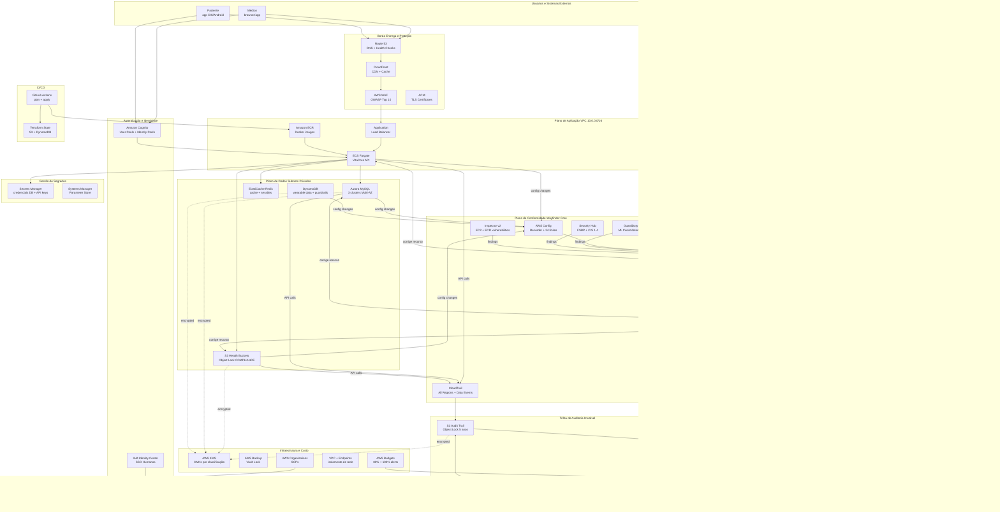

# Arquitetura  Wayfinder Cloud

**Versão:** 2.0 | **Data:** 2026-08-21  
**Responsável:** Rafael Santos (CTO) + Equipe de Arquitetura  
**Status:** Aprovado  Produção

---

## 1. Diagrama Completo de Serviços (Mermaid)



---

## 2. Diagrama de Rede Detalhado

```
Internet
   
    Route 53 (DNS + Health Checks)  CloudFront (CDN + WAF)
                                              
                                        ACM (TLS 1.3)
                                              
 VPC 10.0.0.0/16 
                                                                             
     Public Subnets    
      10.0.1.0/24 (us-east-1a) | 10.0.2.0/24 (us-east-1b)               
    ALB (10.0.1.10 / 10.0.2.10)  CloudFront Origin                    
       NAT GW-1a (10.0.1.4)   NAT GW-1b (10.0.2.4)                        
       [NO Bastion Host  acesso via SSM Session Manager]                  
        
                    ALB  HTTPS only (port 443)                             
   Private App Subnets   
    10.0.10.0/24 (us-east-1a) | 10.0.11.0/24 (us-east-1b)                
    ECS Fargate Tasks (SG: sg-app)                                         
      - vitacore-api:8080 (health check /health)                          
      - Regras SG: ingress 8080 from sg-alb ONLY                          
    Lambda Functions (SG: sg-lambda)                                       
      - compliance-evaluator, auto-remediation, incident-notifier          
      - Regras SG: egress only via VPC Endpoints                           
    VPC Interface Endpoints (no NAT needed for AWS APIs):                 
      - com.amazonaws.us-east-1.config                                    
      - com.amazonaws.us-east-1.cloudtrail                                
      - com.amazonaws.us-east-1.monitoring (CloudWatch)                   
      - com.amazonaws.us-east-1.kms                                       
      - com.amazonaws.us-east-1.sns                                       
      - com.amazonaws.us-east-1.sqs                                       
      - com.amazonaws.us-east-1.secretsmanager                            
      - com.amazonaws.us-east-1.ecr.api + ecr.dkr                        
      - com.amazonaws.us-east-1.ssm + ssmmessages + ec2messages           
    VPC Gateway Endpoints (gratuitos):                                     
      - S3 Gateway Endpoint                                                
      - DynamoDB Gateway Endpoint                                          
    
                    Apenas porta 3306/6379 de sg-app                        
   Private Data Subnets   
    10.0.20.0/24 (us-east-1a) | 10.0.21.0/24 (us-east-1b)                
    Aurora MySQL Writer (10.0.20.10)  us-east-1a                         
    Aurora MySQL Reader (10.0.21.10)  us-east-1b (failover automático)   
    Aurora MySQL Legacy (10.0.20.15)  histórico (migrando para enc.)     
    ElastiCache Redis Primary (10.0.20.20)  us-east-1a                   
    ElastiCache Redis Replica (10.0.21.20)  us-east-1b                   
    SG: sg-data                                                            
      - ingress 3306 from sg-app ONLY                                     
      - ingress 6379 from sg-app ONLY                                     
      - egress: NONE (sem saída da subnet de dados)                       
    
                                                                              
  Security Groups Summary:                                                    
  sg-alb:    ingress 443 from 0.0.0.0/0 (CloudFront only via WAF)           
  sg-app:    ingress 8080 from sg-alb | egress 3306,6379 to sg-data         
  sg-lambda: egress 443 to VPC Endpoints ONLY | no ingress                  
  sg-data:   ingress 3306,6379 from sg-app ONLY | no egress                 

```

---

## 3. Fluxos de Dados Detalhados

### 3.1 Fluxo de Autenticação

```
Médico/Paciente
  1. Acessa vitacore.health (Route 53  CloudFront)
  2. Redireciona para Cognito Hosted UI (HTTPS)
  3. Cognito autentica (MFA obrigatório para médicos)
  4. Retorna JWT: id_token + access_token + refresh_token
  5. Frontend inclui access_token no header Authorization: Bearer
  6. ALB verifica JWT via Cognito Authorizer antes de rotear para ECS
  7. ECS extrai claims do JWT (sub, email, custom:role)
  8. Permissões avaliadas via RBAC interno da aplicação
```

### 3.2 Fluxo de Prontuário Eletrônico

```
Médico (HTTPS/TLS 1.3)
   Route 53 (latency-based routing)
   CloudFront (cache de assets estáticos, WAF)
   WAF (regras OWASP Top 10, rate limiting 1000 req/min/IP)
   ALB (Cognito JWT verification)
   ECS Fargate vitacore-api (HTTPS interna)
   Secrets Manager (busca credenciais Aurora  cached 1h)
   Aurora MySQL Writer (10.0.20.10:3306, TLS, criptografia KMS CMK)
   Resposta retorna pela mesma cadeia
  
  Operações de escrita:
   CloudTrail registra: PutItem, UpdateItem + user, IP, timestamp
   S3 data event registrado se anexo for salvo
```

### 3.3 Fluxo de Dados de Wearable

```
Dispositivo (HTTPS)
   API Gateway (Cognito Authorizer)
   Kinesis Data Streams (2 shards, 7-day retention)
   Lambda processor (batch 100 records, 5s window)
   DynamoDB vitacore-wearable-data (SSE KMS CMK, PAY_PER_REQUEST)
   EventBridge: anomalia detectada  alerta para médico
  
  Agregação diária (01h UTC):
   EventBridge Scheduler  Glue ETL Job
   S3 analytics (health-standard, Parquet, particionado por data)
   Athena para consultas do médico no prontuário
```

### 3.4 Fluxo de Conformidade (Wayfinder Core)

```
Recurso AWS muda de configuração
   AWS Config Configuration Item gerado (< 1 minuto)
   Config Rule avaliada (managed ou custom Lambda)
   Se NON_COMPLIANT:
       EventBridge event publicado no bus wayfinder-events
       Rule de roteamento por severidade:
          CRITICAL  Lambda compliance-evaluator (direto)
          HIGH      Lambda compliance-evaluator via SQS
          MEDIUM    SQS para processamento async
       compliance-evaluator:
          1. Enriquece evento: account, region, resource, tags, owner
          2. Verifica guardrails (tag "remediation-exempt=true"?)
          3. Determina tipo de remediação (automática vs manual)
          4. Publica métrica CloudWatch wayfinder/Compliance/NonCompliant
          5. Se remediação automática: invoca auto-remediation Lambda
          6. Registra evento no S3 audit trail (imutável)
       auto-remediation executa correção via SDK
       incident-notifier formata e envia alerta
```

### 3.5 Fluxo de Auditoria

```
Qualquer API call na conta AWS
   CloudTrail (management events + S3/RDS data events)
   S3 audit-trail bucket (criptografado KMS, Object Lock 5 anos)
   Glue Crawler (diário 03h UTC): atualiza Data Catalog
   Athena: queries ad-hoc via console ou Lambda audit-reporter
  
  Relatório semanal (sexta-feira 17h UTC):
   EventBridge Scheduler  Lambda audit-reporter
   Queries Athena: conformidade 7d, top violations, remediações executadas
   Relatório JSON + PDF armazenado em S3 com metadados de período
   SNS INFO  email para DPO + CTO + Board members
```

---

## 4. Decisões de Multi-AZ e Alta Disponibilidade

| Serviço | Configuração Multi-AZ | Failover | Notas |
|---|---|---|---|
| Aurora MySQL | Writer us-east-1a + Reader us-east-1b | Automático < 30s | Failover testado mensalmente |
| ECS Fargate | Tasks em 2 AZs, min 2 tasks | ALB redistribui | Desired count: prod=4, dev=1 |
| ElastiCache Redis | Primary 1a + Replica 1b | Automático (Multi-AZ mode) | Cache de sessões: TTL 30min |
| NAT Gateway | 1 por AZ em prod | Roteamento por AZ | Dev: 1 NAT GW apenas (custo) |
| ALB | Spans 2 AZs nativamente | Automático | Health check /health a cada 10s |
| S3 | 11 9s durability nativo | N/A  regional | Object Lock protege vs delete |
| DynamoDB | Global Tables ou Regional | Automático | Prod: Regional + AWS Backup |

---

## 5. Lista Completa de Serviços AWS

### 5.1 Serviços de Aplicação

**Amazon ECS Fargate**
- Papel: executa os containers da API VitaCore Health (vitacore-api)
- Integração: ECR (imagens)  ALB (tráfego)  Aurora/Redis (dados)
- Config Rule: WAYFINDER-011 (privileged=false), WAYFINDER-006 (não em subnet pública)
- Justificativa vs EC2: serverless, sem gerenciamento de SO, escala automática por CPU/memória

**Amazon Aurora MySQL**
- Papel: banco de dados principal para prontuários, laudos, dados clínicos
- Integração: ECS (cliente), Secrets Manager (credenciais), KMS (criptografia), AWS Backup
- Config Rule: WAYFINDER-004 (criptografia), `rds-storage-encrypted`
- Justificativa vs RDS MySQL: failover automático < 30s, up to 15 read replicas, Serverless v2 option

**Amazon ElastiCache Redis**
- Papel: cache de sessões Cognito, cache de consultas frequentes de prontuários, rate limiting
- Integração: ECS (cliente via TLS), KMS (criptografia at-rest)
- Config Rule: `elasticache-redis-cluster-automatic-backup`
- Justificativa vs Memcached: persistência, cluster mode, pub/sub para notificações internas

**Amazon Kinesis Data Streams**
- Papel: ingestão em tempo real de dados de wearables (~2,4M eventos/dia)
- Integração: API Gateway (produtor), Lambda (consumidor), DynamoDB (destino)
- Configuração: 2 shards, retention 7 dias, server-side encryption KMS
- Justificativa vs SQS: ordering por partition key (patient_id), replay de eventos, múltiplos consumidores

### 5.2 Serviços de Borda e Entrega

**Amazon CloudFront + AWS WAF**
- Papel: CDN para assets estáticos, proteção DDoS Layer 3/4/7, OWASP Top 10
- WAF Rules: AWSManagedRulesCommonRuleSet, AWSManagedRulesKnownBadInputsRuleSet, rate limiting
- Integração: Route 53 (DNS)  CloudFront  WAF  ALB
- Config Rule: `wafv2-webacl-not-empty`

**Amazon Route 53**
- Papel: DNS autoritativo, health checks (30s interval), failover routing
- Configuração: latency-based routing entre CloudFront distributions (futuro: multi-region)
- Integração: ACM (certificados), CloudFront, ALB

**Amazon Cognito**
- Papel: autenticação de médicos (MFA obrigatório) e pacientes, federação com Google/Apple
- Configuração: User Pools separados por persona; Identity Pools para acesso a S3 signed URLs
- Integração: ALB (JWT authorizer), ECS (claims), API Gateway

**AWS Certificate Manager (ACM)**
- Papel: TLS 1.3 para CloudFront, ALB, e APIs internas
- Renovação automática; wildcard cert para *.vitacore.health

### 5.3 Serviços de Governança e Conformidade (Wayfinder Core)

**AWS Config**
- Papel: rastrear mudanças de configuração em todos os recursos, avaliar compliance continuamente
- Configuração: all-supported resources, multi-region, snapshot diário
- 24 Rules: 12 managed + 14 custom (WAYFINDER-001 a WAYFINDER-014)
- Delivery: S3 audit bucket + SNS INFO

**AWS CloudTrail**
- Papel: log imutável de todas as API calls, data events S3 e RDS
- Configuração: multi-region trail, log file validation, S3 data events para buckets health-*
- Destino: S3 Object Lock COMPLIANCE 5 anos
- Config Rule: `cloud-trail-enabled`, `cloudtrail-s3-dataevents-enabled`, WAYFINDER-003

**AWS Security Hub**
- Papel: postura de segurança consolidada, agrega findings de GuardDuty, Inspector, Config
- Standards: AWS FSBP + CIS AWS Foundations 1.4
- Integração: EventBridge  Lambda compliance-evaluator para findings HIGH/CRITICAL
- Meta: score FSBP > 85% em prod

**Amazon GuardDuty**
- Papel: detecção de ameaças com ML (reconhecimento, exfiltração, comprometimento de credenciais)
- Configuração: finding_publishing_frequency = SIX_HOURS, S3 protection habilitado
- Integração: EventBridge  Lambda incident-notifier para findings HIGH/CRITICAL
- Config Rule: `guardduty-enabled-centralized`

**AWS Inspector v2**
- Papel: varredura de vulnerabilidades em EC2 (OS + aplicações) e imagens ECR (container)
- Configuração: continuous scanning habilitado para EC2 + ECR
- Integração: Security Hub (findings centralizados), EventBridge
- Config Rule: `inspector-ec2-scan-enabled`

### 5.4 Serviços de Auditoria e Análise

**AWS Glue**
- Papel: ETL e catalogação dos logs do CloudTrail, dados de wearables
- Configuração: Crawler diário (03h UTC), Data Catalog para Athena
- Integração: S3 (fonte e destino), Athena (consumidor do catálogo)

**Amazon Athena**
- Papel: SQL sobre logs CloudTrail e dados auditáveis  investigação forense, relatórios
- Configuração: workgroup `wayfinder-audit` com limites de scan (10GB/query)
- Integração: Glue Data Catalog, S3 (source + results), Lambda audit-reporter

**Amazon QuickSight** *(roadmap Q1/2027)*
- Papel: dashboards executivos para CEO/Board com KPIs de postura de segurança
- Integração planejada: Athena  QuickSight SPICE datasets
- Status: não implementado  Athena + CloudWatch Dashboard cobrem necessidade atual

### 5.5 Serviços de Segurança de Infraestrutura

**AWS KMS  Customer Managed Keys**
```
Chaves CMK por classificação de dado:
vitacore-health-critical-key   S3 buckets health-critical, Aurora prontuários
vitacore-health-standard-key   DynamoDB wearables, S3 health-standard
vitacore-financial-key         RDS faturamento, S3 financeiro
vitacore-audit-key             S3 audit trail, CloudWatch Logs
vitacore-infra-key             ECR, Secrets Manager, EBS volumes
```
- Rotação automática anual habilitada para todas as CMKs
- Key policies com condition `aws:ResourceTag/data-classification`

**AWS Secrets Manager**
- Papel: armazenar credenciais Aurora, API keys de laboratórios, chaves de integração
- Rotação automática: Lambda built-in para Aurora a cada 30 dias
- Integração: ECS (task definition envFrom), Lambda (runtime SDK call)
- Config Rule: `secretsmanager-rotation-enabled`, WAYFINDER-014
- Custo: $0.40/secret/mês + $0.05/10.000 chamadas

**AWS Systems Manager**
- Parameter Store: configurações não-sensíveis (feature flags, URLs de serviços)
- Session Manager: acesso SSH-less a ECS tasks para debug (substituiu Bastion Host)
- Patch Manager: patching de AMIs base e ECS instances (se EC2-backed)

**AWS Backup**
- Papel: backup centralizado com Vault Lock para todas as resources críticas
- Configuração: vault lock COMPLIANCE mode para backups de Aurora, DynamoDB, S3
- Plano: Aurora diário (retain 35 dias), semanal (retain 1 ano), mensal (retain 7 anos)
- Config Rule: `backup-plan-min-frequency-and-min-retention-check`

### 5.6 Serviços de Observabilidade

**Amazon CloudWatch**
- Log Groups: /vitacore/app, /vitacore/wayfinder/*, /aws/lambda/wayfinder-*
- Custom Metrics: wayfinder/Compliance/NonCompliant, wayfinder/Remediation/AutoFixed
- Dashboard: "Wayfinder Command Center" com 12 widgets
- Alarms: 8 alarmes críticos, 5 de aviso

**AWS X-Ray**
- Papel: tracing distribuído nas Lambdas de governança
- Configuração: sampling rate 5% (custo) + 100% para traces com erros
- Integração: CloudWatch ServiceMap para visualizar fluxo de eventos

**AWS Budgets**
- Budget #1: custo total mensal  alert 80% (WARNING), 100% (CRITICAL)
- Budget #2: custo EC2+RDS  alert 70% para detectar instâncias ociosas
- Integração: SNS WARNING topic  email + Slack

### 5.7 Serviços de CI/CD e IaC

**GitHub Actions + Amazon ECR**
- Papel: CI/CD para containers da aplicação e Terraform da governança
- Workflows: terraform-plan.yml (PR), terraform-apply.yml (merge to main)
- ECR: repositórios por serviço, image scanning habilitado, lifecycle policy (keep 10 últimas)

**AWS Organizations + SCPs**
- Papel: guardrails de conta que nenhum IAM user/role pode contornar
- SCPs ativas: `require-mfa-for-console`, `deny-root-account-actions`,
  `require-encryption-at-rest`, `restrict-regions-to-us-east-1`

---

## 6. Estimativa de Custo Detalhada

### 6.1 Ambiente Dev

| Serviço | Configuração | Custo Mensal (USD) | Tier |
|---|---|---|---|
| AWS Config | 15 rules, ~50 resources | $5.00 | Pago |
| CloudTrail | 1 trail management events | $0.00 | Free (1 trail) |
| CloudTrail data events | 100k events/mês | $0.10 | Pago |
| Lambda (4 funções) | 50k invocações/mês | $0.10 | Free tier |
| S3 audit trail | 5GB, Object Lock | $0.12 | Pago |
| Athena | 10GB scan/mês | $0.50 | Pago |
| CloudWatch Logs | 2GB ingest/mês | $1.02 | Pago |
| CloudWatch Dashboard | 1 dashboard | $3.00 | Pago |
| CloudWatch Alarms | 13 alarms | $3.90 | Pago |
| KMS | 5 CMKs + 50k requests | $5.25 | Pago |
| GuardDuty | 50GB VPC Flow/mês | $1.25 | Pago |
| Security Hub | 50 resources | $0.75 | Pago |
| Inspector v2 | ECR only (dev) | $0.09 | Pago |
| SNS | 3 topics, 1k emails | $0.10 | Free tier + $0.10 |
| Secrets Manager | 5 secrets | $2.00 | Pago |
| EventBridge | 100k events | $0.01 | Pago |
| VPC Endpoints | 2 interface endpoints | $14.40 | Pago |
| **TOTAL DEV** | | **~$38/mês** | |

### 6.2 Ambiente Prod (estimativa com aplicação VitaCore completa)

| Serviço | Configuração | Custo Mensal (USD) |
|---|---|---|
| AWS Config | 24 rules, ~200 resources | $18.00 |
| ECS Fargate | 4 tasks, 0.5vCPU/1GB | $35.00 |
| Aurora MySQL | 2 clusters Multi-AZ, db.r6g.large | $380.00 |
| ElastiCache Redis | cache.r6g.large, 2 nodes | $145.00 |
| CloudFront | 50GB transfer/mês | $4.25 |
| WAF | 2 WebACLs + rules | $18.00 |
| Kinesis Data Streams | 2 shards | $22.00 |
| S3 (todos os buckets) | 500GB total | $11.50 |
| Secrets Manager | 15 secrets | $6.00 |
| GuardDuty | produção completa | $15.00 |
| Security Hub | produção | $3.50 |
| Inspector v2 | EC2 + ECR | $4.50 |
| CloudWatch | prod volume | $25.00 |
| KMS | 5 CMKs + 500k requests | $7.50 |
| NAT Gateway | 2 NATs, 100GB/mês | $75.00 |
| VPC Endpoints | 10 interface endpoints | $72.00 |
| AWS Backup | 1TB backup storage | $25.00 |
| **TOTAL PROD** | | **~$870/mês** |

> **Nota de otimização:** NAT Gateway ($75) e VPC Interface Endpoints ($72) são os
> maiores custos de infraestrutura de rede. Em dev, reduzir para 1 NAT GW e
> 2 interface endpoints economiza ~$90/mês.
